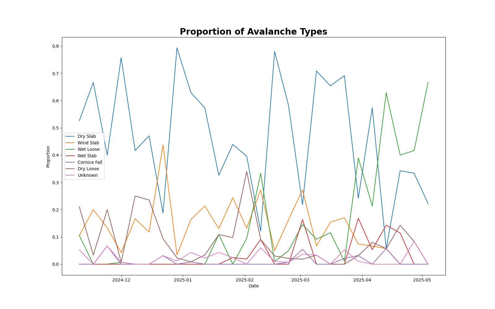
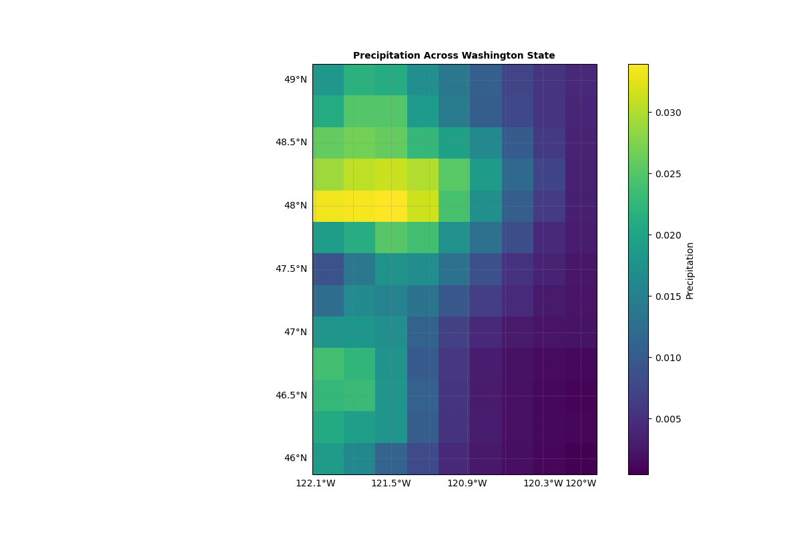
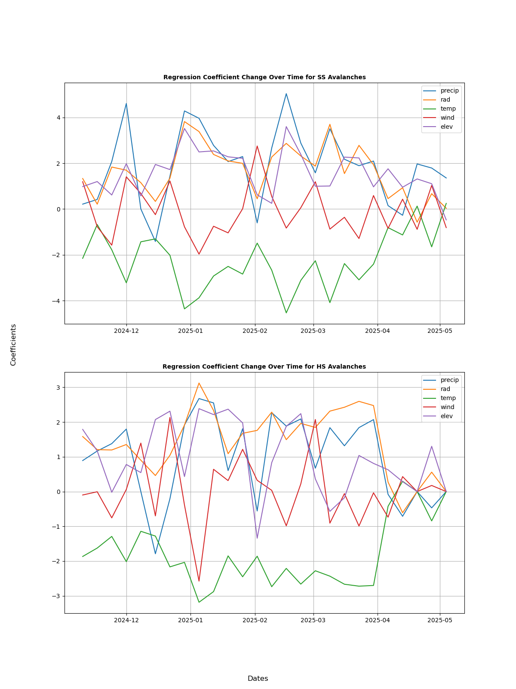
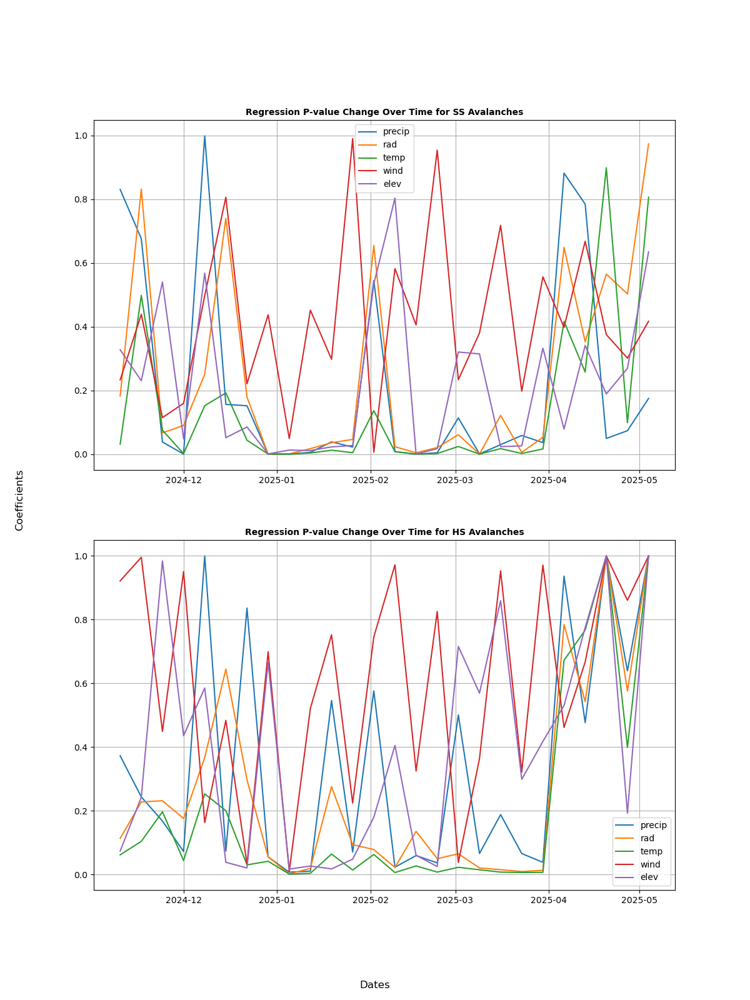

# Predicting Avalanche Incidents in Colorado
Every year, approximately 27 people die from an avalanche in the United States, with hundreds more being non-fatally buried and likely many going unreported. In regions that pose high risks of avalanches, this threat is more prevalent than any other natural event. The Colorado Avalanche Information Center (CAIC) compiles these incidents and creates routine reports of avalanche danger risks across Colorado. Based on this analysis, they also respond to potential threats in regions through breaking down snow slabs or shutting down roads. However, they need to be able to look at forecasting data to predict which regions are of highest incoming danger to decide where to allocate their resources and time. If we could analyze the conditions that lead up to an avalanche occurrence, we can attempt to predict regions where an avalanche is imminent and issue warnings before another incident takes place. 

  Colorado fits the perfect mold to attempt this feat, being a state that occupies a third of the avalanche incidents in the United States. Colorado also models an environment that simultaneously is avalanche-prone and contains a wide range of varying weather conditions. They have high-elevation areas, an acceptable amount of precipitation, and an erratic amount of wind. The Colorado Avalanche Information Center also offers freely available data on each reported avalanche sighting for the past ~70 years, with details on their locations, avalanche type, date, and more. We can use this data alongside external weather/topographical data to try to predict and visualize why these avalanches are occurring. 

  There are several types of avalanches that each have certain conditions that exemplifies their potential as a threat. I was interested in understanding which avalanche types are most relevant and whether they change throughout the season: 

  Through this graph, we can see that Colorado experiences a steady level of mostly Dry Slab avalanches and a lower amount of Wind Slab avalanches through the winter. However, starting around in April, the proportion of Wet Loose (WL) avalanches started to spike as Spring arrived. Moving forward, I will only consider these three avalanche types during analysis, given that they compose an overwhelming proportion of the avalanche incidents in the data. But knowing the difference between these avalanche types is crucial in getting the full picture of why this may have happened.

  **Slab Avalanches:**[^2]

  Slab avalanches occur when a large “slab” of compacted snow is separated from the ground or other snow. This is often triggered by added weight by a person, but it can be triggered by various external factors that add pressure as well. Dry and wind slab avalanches are characterized by how the compacted snow was formed, respectively either through wind deposition or of snow with low moisture.

  **Wet Loose Avalanches:**[^2]

  Wet Loose avalanches occur as a result of some form of external factor weakening the snow’s surface and resulting in a large amount of snow falling down a slope. It is important to note that this often requires steep elevation since a larger slope makes it easier for the snow to lose cohesion and start tumbling. Also, these avalanches are typically as a result of warmer temperatures, which explains why they started to make a meaningful appearance starting around springtime. 

  Upon understanding the avalanche types of interest, we can see that there are particular variables that have potential to act as a trigger to these avalanche incidents. Slab avalanches, while often started by human weight, are supported by wind-compacted snow and can also be started by factors like precipitation adding pressure onto the slabs where humans may not, or elevation accentuating the previous two factors. Wet Loose avalanches on the other hand can find issues in any factor that may cause snow to lose cohesion, like radiation and higher temperatures. 

  Moving forward, I will look to obtain some of these “tells” to act as my predictor variables in my regression model moving forward. In particular I will select the following variables:
  
  - Precipitation (m)
  
  - Surface Solar Radiation Downwards (SSRD) (J/m^2)
  
  - Temperature at 2m (K)
  
  - Wind Magnitude (m/s)*
  
  - Elevation (m)

  *<small>obtained by squaring magnitudes of wind in both directions, adding them, and taking the square root of the result.</small>

### <ins>Weather Data Organization</ins>
  
  I have obtained data on the first four variables from the European Centre for Medium-Range Weather Forecasts (ECMWF). For example, below is a map of precipitation measured across February 1st, 2025 in Washington.
 

  Notably this data is split into cells spanning .25x.25 degrees of longitude and latitude. This is the case for every variable recorded by the ECMWF, but not for the elevation. The elevation data was obtained by a DEM (Digital Elevation Model) by OpenTopography. However, this data was composed with much higher resolution and smaller cells, but which was quickly resolved by taking the mean of all cells within the original bounds of each cell from the ECMWF data. 

### <ins>Building a Logistic Model</ins>

  When building a regression model, I first had to decide what constitutes an “observation” within our data. On instinct, it feels like a day should be an observation, although that would require us to aggregate data across each cell, which would result in messy representations of variables like elevation, which would stay stagnant and in an unfit middle-area. So instead, I decided to use each cell as an observation, determining how these variables determine avalanche occurrence by seeing the variables and number of avalanches in each individual cell.

  I practiced this initially over a few days but immediately found an issue. With the observations covering every region in Colorado (including ones with low elevation), elevation ended up being a dominant determinant of avalanche occurrence since all of the avalanches occurred in high elevation regions where they only could. To combat this, I decided to look at all the cells where an avalanche had occurred in the CAIC dataset (Nov24 - Apr25), and subset those cells along with all cells surrounding those. This way, I was only modeling off of regions where an avalanche could actually reasonably occur. I also decided to aggregate the data by week to avoid any specific day biases which may occur considering that the CAIC data was purely collected by human record, implying that days where people are outdoors more with have an unproportionate amount of avalanche sightings. Additionally, many individual days would have little to none avalanche sightings, causing highly variable predictor coefficients since it would  often be predicting off of nothing.

  With this new data set up, I repeated my logistic regression fitting and repeated it across each week in the avalanche sighting data for each avalanche type. I plotted the change of the coefficients and p-values over each predictor below.

### <ins>Assessing the Results</ins>

[^1]: Statistics and reporting. Colorado Avalanche Information Center. (n.d.). [https://avalanche.state.co.us/accidents/statistics-and-reporting#:~:text=Avalanche%20Accident%20Statistics,Public%20%2D%20Please%20cite%20the%20CAIC.](https://avalanche.state.co.us/accidents/statistics-and-reporting#:~:text=Avalanche%20Accident%20Statistics,Public%20%2D%20Please%20cite%20the%20CAIC.) 
[^2]: Avalanche.org " Avalanche encyclopedia. Avalanche.org. (2019, December 18). [https://avalanche.org/avalanche-encyclopedia/#avalanche](https://avalanche.org/avalanche-encyclopedia/#avalanche) 